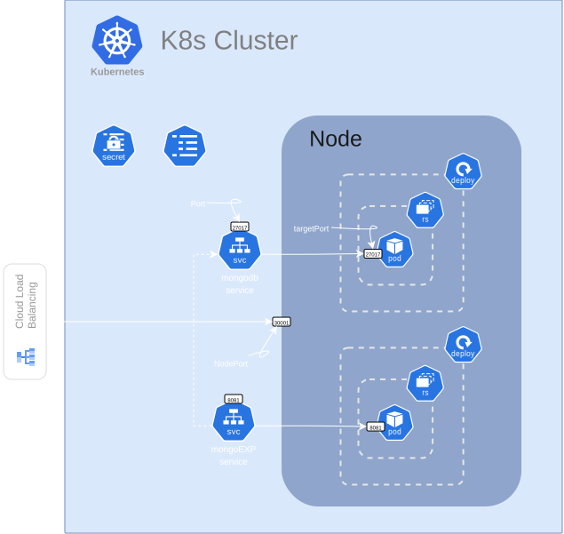

# Lab 03: Demo Deployment

in this demo we will deploy a MongoDB database, with mongo express as a web-based interface to manage the database.

> [!NOTE]
> its not recommanded to use the `Deployment` with the databases and the services that need to be persistent, its better to use `StatefulSet` we do this demo just to show you how to use the deployment and the service together.

### Architecture:

    

this deployment consist:
- 2 Deployments:
  - MongoDB Deployment (1 pod)
  - Mongo Express Deployment (1 pod)
- 2 Services:
  - MongoDB Service (ClusterIP)
  - Mongo Express Service (NodePort)
- 1 ConfigMap for Mongo Express configuration.
- 1 Secret for MongoDB credentials.

and you will find all the details of etch component in the `components` folder, and all the configuration files for this demo in the `k8s` folder.

### Important Note:
The network structure may look confusing at first, but there is one important concept to understand: a Kubernetes **Service** is **not** a separate application or process running inside the cluster.

Instead, you can think of a Service as a **virtual IP address (ClusterIP)** combined with a set of routing rules. These rules determine which Pods should receive incoming traffic based on the Service's `selector`.

When you create a Service, Kubernetes assigns it a virtual IP address and configures the cluster's networking accordingly. The **`kube-proxy`** component running on each node programs the necessary networking rules (such as `iptables` or `IPVS`) so that any traffic sent to the Service's virtual IP is automatically forwarded to one of the Pods whose labels match the Service's `selector`.

In other words, a Service is primarily a networking abstraction. The actual packet forwarding is performed by `kube-proxy`, which transparently routes requests from the Service's virtual IP to the appropriate backend Pods.
